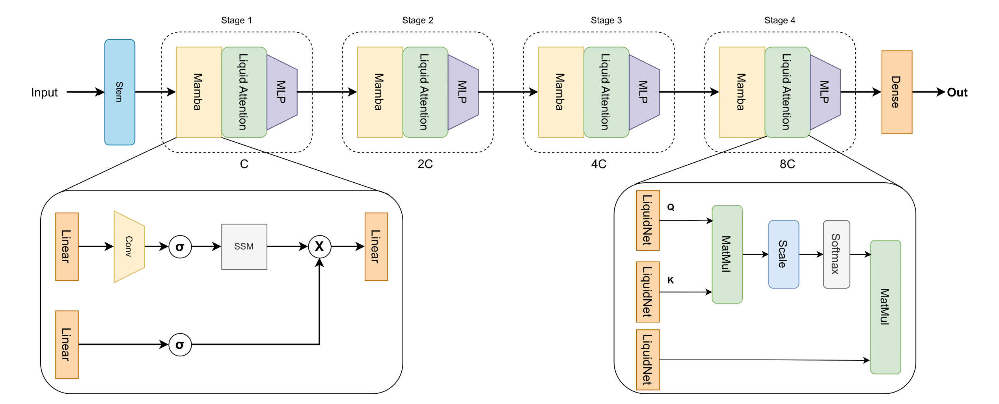
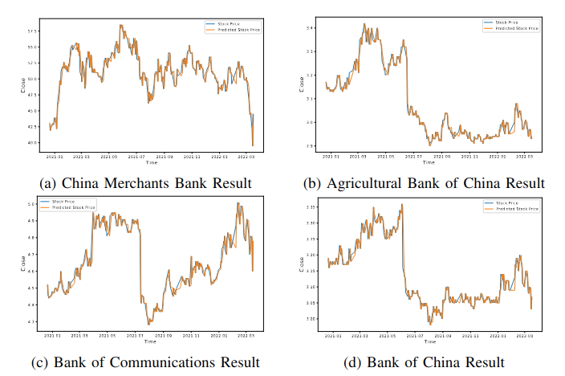

# LiquidMamba: Liquid Neural Network Attention Based Mamba For Stock Prediction

[](https://github.com/enesdoruk/MambaLiquid)

> **Authors:** [Abdullah Enes Doruk](www.linkedin.com/in/enesdrk) and [Ahmet Mete Dokgoz]()

## Abstract

Stock market prediction is a complex challenge due to the dynamic and multifaceted nature of financial data, influenced by factors such as market trends, economic indicators, and investor behavior. Traditional forecasting models often fail to capture these intricate relationships, leading to significant forecasting errors. To address these limitations, this paper presents a novel hybrid model that combines Mamba blocks with self-attention mechanisms derived from liquid neural networks. Our approach leverages the efficient feature extraction capabilities of Mamba blocks while utilizing self-attention to effectively model temporal dependencies and nonlinear interactions within the data. We rigorously evaluated our hybrid model on a comprehensive stock market dataset, encompassing extensive historical price movements and trading volumes, which allowed us to benchmark against various state-of-the-art forecasting methods. Experimental results demonstrate that our hybrid approach significantly outperforms existing techniques in prediction accuracy and robustness to market volatility, highlighting the potential of advanced neural network architectures to enhance financial forecasting.

<p align="center">

</p>

## Installation (Python 3.8.19)

This project tested under pytorch 2.4.1 and CUDA 12.4 versions. However, you can work with CUDA 11x and related Pytorch versions.

The code has been tested running under Python 3.8.19, with the following packages and their dependencies installed:
```
numpy==1.16.5
matplotlib==3.1.0
sklearn==0.21.3
pandas==0.25.1
pytorch==2.4.1
```

The stock data used in this repository was downloaded from [TuShare](https://tushare.pro/). The stock data on [TuShare](https://tushare.pro/) are with public availability. Some code of the Mamba model is from https://github.com/alxndrTL/mamba.py


## Training MambaLiquid

Command can be found training bash file  `scripts/training_transadapter.sh`.
If you do not want to train baseline model, you can set ``--pseudo_lab False``

```
python train.py 
```

## Benchmark Results


<p align="center">

</p>

## Acknowledgement

- We thank the authors of [MambaStock](https://github.com/zshicode/MambaStock) and their open-source codes.
